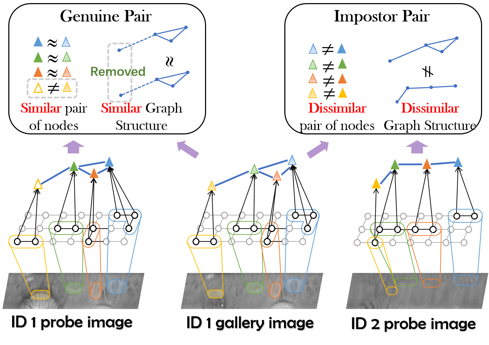
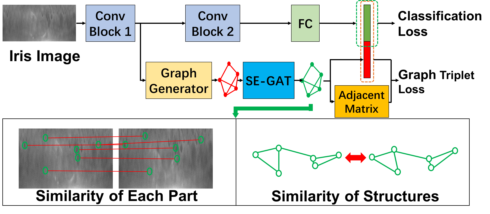
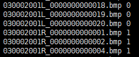
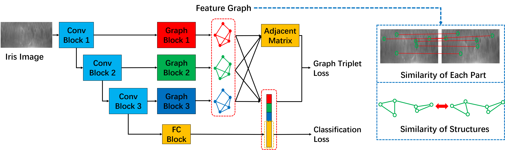

# Dyamic_Graph_Representation
This is the code of AAAI paper 《Dynamic Graph Representation for Occlusion Handling in Biometrics》
  
We propose a novel unified framework integrated the merits of both CNNs and graphical models to learn dynamic graph representations for biometrics ercognition, called Dynamic Graph Representation (DGR). Convolutional features onto certain regions are re-crafted by a graph generator to establish the connections among the spatial parts of biometrics and build Feature Graphs based on these node representations. Each node of Feature Graphs corresponds to a specific part of the input image and the edges express the spatial relationships between parts. By analyzing the similarities between the nodes, the framework is able to adaptively remove the nodes representing the occluded parts. During dynamic graph matching, we propose a novel strategy to measure the distances of both nodes and adjacent matrixes. In this way, the proposed method is more convincing than CNNs-based methods because the dynamic graph method implies a more illustrative and reasonable inference of the biometrics decision.

## The proposed framework

# Usage Instructions

## Requirments

python == 3.7

pytorch == 1.1.0

torchvision == 0.3.0

## Training

### Data preparing

The recognition model is trained by normalized iris images. All of your training images should be stored in one folder. The labels should be recorded by a `.txt` file.
Image names are followed by labels in the label file. One row per image.

An example of label file:

### Start Training

`configs/config_train_singlescale.py`to set the configurations of training.

`train_singlescale.py` to begin training.

## Feature extraction

Pretrained model can be downloaded from [Baidu Netdisk](https://pan.baidu.com/s/1fOkdHLThw5x0QiFT2f5zYQ), code: g3sn

`configs/config_FE.py`to set the configurations of feature extraction.

`feature_extraction_singlescale.py` to extract features.

## Test

`configs/config_test.py`to set the configurations of test.

`test.py` to test.

### Performance

Dataset       | ND-LG4000 | CASIA-Distance | CASIA-M1S2 | CASIA-Lamp
--- |--- |--- |--- |--- 
FRR@FAR=0.01% | 3.02%     | 6.94%          | 6.57       | 5.92%
EER           | 0.62%     | 1.71%          | 0.76%      | 0.61%

# Update

Multi-scale strategy is integrated into the DGR.

# Citation
@inproceedings{ren2020dynamic,
  title={Dynamic Graph Representation for Occlusion Handling in Biometrics.},
  author={Ren, Min and Wang, Yunlong and Sun, Zhenan and Tan, Tieniu},
  booktitle={AAAI},
  pages={11940--11947},
  year={2020}
}
